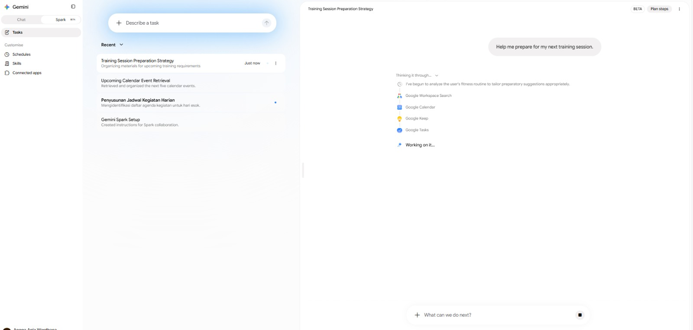
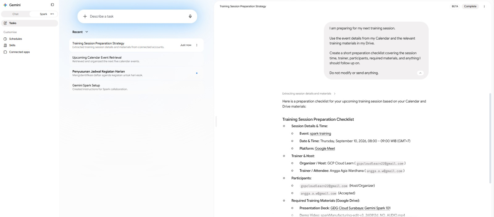

# Lab 02 — Teach It the Job: Building an Agent Brief

> **Connected project:** In Lab 01, you connected your Gemini Spark assistant to your Google Workspace. Now it's time to teach it how you want work to be done.

## 🎯 Goal

Learn how to give an AI agent enough context to produce a useful result — without writing a giant, complicated prompt.

You'll use the **Agent Brief**:

**Context → Job → Output → Boundaries**

By the end of this lab, you'll have one tested instruction that you can reuse for future tasks.

## 🛠️ What You'll Build

A reusable **Agent Brief** and one refined instruction for a real task.

**Tools and techniques:** Agent instructions, structured prompting, context, output formatting, boundaries, iteration

## ✅ Prerequisites

- Lab 01 complete.
- Gemini Spark connected to your Google Workspace.
- A simple, non-confidential task you would like to delegate.

> **Tip:** Pick something you already do manually. The best first agent task is usually something boring and repetitive. 😆

---

# 🚀 Steps

## Step 1 — Start with a vague request

Let's see what happens when we give the agent almost nothing to work with.

Try this:

```text
Help me prepare for my next training session.
```

Run the instruction and look at the result.



Don't worry if Spark asks questions or gives you something generic.

That's the point.

### 🤔 Think about it

What information did Spark have to guess?

- Which training session?
- What does "prepare" mean?
- What information should it use?
- What should the final result look like?

---

## Step 2 — Give the agent some context

Now let's give Spark a clearer picture of the task.

Try:

```text
I am preparing for my next internal training session.

Use the event details from my Calendar and the relevant training materials in my Drive.

Create a short preparation checklist covering the session time, trainer, participants, required materials, and anything I should follow up on.

Do not modify or send anything.
```

Run the instruction again.

Compare this result with the previous one.



The agent now has a much better idea of what you actually want.

---

## Step 3 — Discover the Agent Brief

The second instruction worked better because it gave Spark four important pieces of information.

### CONTEXT

What does the agent need to know?

Example:

```text
I am preparing for my next internal training session.
```

### JOB

What should the agent actually do?

Example:

```text
Prepare a short checklist for the session.
```

### OUTPUT

What should the result look like?

Example:

```text
A checklist covering the session time, trainer, participants, materials, and follow-ups.
```

### BOUNDARIES

What should the agent avoid doing?

Example:

```text
Do not modify or send anything.
```

Together:

```text
CONTEXT
    ↓
What does the agent need to know?

JOB
    ↓
What should it do?

OUTPUT
    ↓
What should it produce?

BOUNDARIES
    ↓
What should it NOT do?
```

This is your **Agent Brief**.

---

## Step 4 — Save your Agent Brief template

Keep this template somewhere you can easily reuse it:

```text
CONTEXT:
<background information the agent needs>

JOB:
<what you want the agent to do>

OUTPUT:
<what the result should look like and where it should go>

BOUNDARIES:
<what the agent must not do>
```

You don't have to fill every section with a huge paragraph.

The goal is to give the agent the **right information**, not the most information.

---

## Step 5 — Add sensible boundaries

Agentic systems can do more than simply generate text.

That means boundaries matter.

For this workshop, use a simple default:

```text
Do not send emails, share files, delete information, or make changes without my approval.
```

You can add more specific boundaries depending on the task.

For example:

```text
Use only information from my connected Workspace.
```

or:

```text
Do not invent missing participant information.
```

or:

```text
If required information is missing, tell me instead of guessing.
```

> **Good boundaries don't make an agent less useful. They make delegation safer.**

---

## Step 6 — Brief your own agent

Now it's your turn.

Choose one small task related to your work or daily routine.

For example:

- Prepare a meeting summary.
- Find information needed for an upcoming event.
- Organise files related to a project.
- Prepare a checklist.
- Summarise information from several emails.

Write your instruction using the Agent Brief:

```text
CONTEXT:
<background>

JOB:
<task>

OUTPUT:
<desired result>

BOUNDARIES:
<what the agent should not do>
```

Run it in Gemini Spark.

---

## Step 7 — Improve one thing

Don't rewrite everything.

Pick **one** part of your instruction and improve it.

For example, make the output more specific:

### Before

```text
OUTPUT:
Give me a summary.
```

### After

```text
OUTPUT:
Create a table with the item, owner, deadline, current status, and next action.
```

Run the instruction again.

Compare the two results.

### 🤔 Ask yourself

Did changing one part of the brief make the result more useful?

---

## Step 8 — Keep the better version

Take the instruction that produced the better result.

Save it somewhere you can find later.

This is important because a good instruction doesn't have to remain a one-time prompt.

Later in the workshop, you'll turn a proven instruction into something much more useful:

> **A reusable Skill.**

---

# ✅ Success Criteria

You're ready for the next lab when you can show:

- [ ] A vague instruction and its result.
- [ ] A more structured instruction and its improved result.
- [ ] Your own **Agent Brief** template.
- [ ] One real task written using Context, Job, Output, and Boundaries.
- [ ] One refinement that improved the result.
- [ ] Your best instruction saved for later reuse.

---

# 🧯 Troubleshooting

### The agent still gives me a generic answer

Look at your **Context** and **Output**.

Ask yourself:

- Does the agent know what I'm talking about?
- Did I tell it exactly what I want back?

"Prepare a summary" is very different from:

```text
Create a 5-bullet summary highlighting decisions,
open questions, owners, and deadlines.
```

### The agent asks too many questions

Your **Context** or **Job** may be unclear.

Tell the agent:

- Which information to use.
- What time period to consider.
- Which files, emails, or Calendar events matter.

If something genuinely isn't available, let the agent ask rather than encouraging it to guess.

### The result is useful but formatted badly

Your **Output** needs more detail.

Specify things such as:

- Table vs. bullets.
- Number of items.
- Required fields.
- Level of detail.
- Destination, if the task involves creating a file.

### The agent did something I didn't expect

Check your **Boundaries**.

If an action matters, say so explicitly.

For example:

```text
Do not send, share, delete, or modify anything.
Ask for my approval before taking an external action.
```

---

# 🚀 Challenge

Write the **same task three different ways**:

### Version 1 — Minimal

Give Spark only the basic request.

### Version 2 — Structured

Use:

```text
CONTEXT
JOB
OUTPUT
BOUNDARIES
```

### Version 3 — Over-specified

Give Spark extremely detailed instructions covering every possible step and formatting requirement.

Run all three.

Then decide:

> **Which version gave you the best result without making you do unnecessary prompt-writing work?**

The goal isn't to write the longest instruction.

It's to give the agent the **right briefing**.

---

# 🤔 Reflection

You've now seen how the same agent can produce very different results depending on how you brief it.

In your own words:

> **Which part of the Agent Brief had the biggest impact on your result — Context, Job, Output, or Boundaries? Why?**

And one more:

> **Would you give the same instruction to a human colleague?**

If not, what would you change?

---

## 🎉 Done!

You've connected Spark to your Workspace.

You've given it a job.

And you've learned how to brief it properly.

Next, we'll stop practicing with instructions and actually **send the agent to work**.

# **Lab 03 — Send It to Work 🚀**
