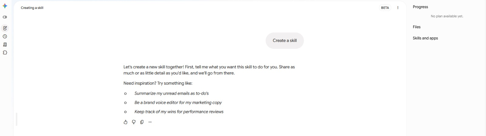
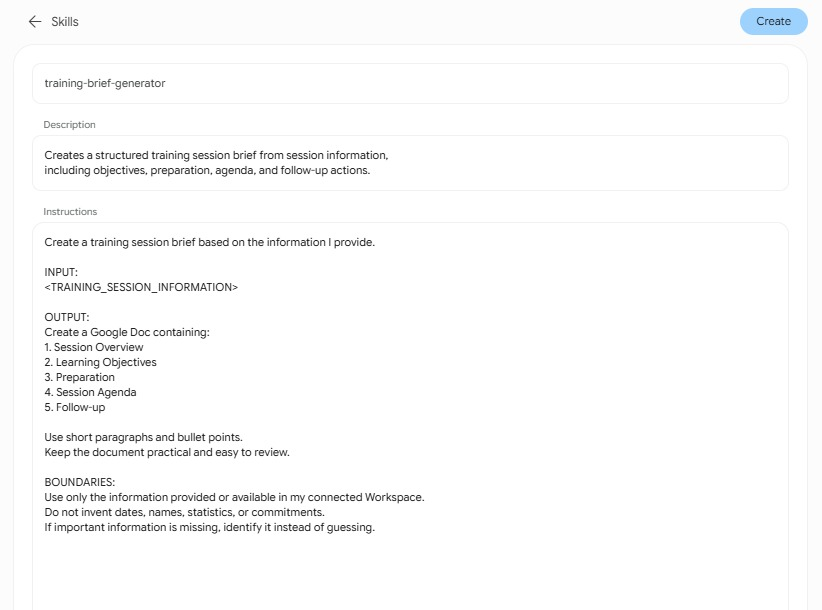
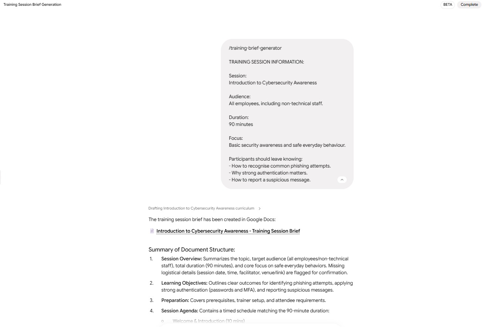

# Lab 06 — Build a Skill: Teach It Once, Reuse It 🧠✨

> **Connected project:** In Lab 05, you created a training package using Docs, Sheets, and Slides. You've now built several instructions that work. It's time to turn one of those proven workflows into something reusable.

## 🎯 Goal

Turn a successful agent instruction into a **reusable Skill**.

You'll learn how to:

- Identify a workflow worth reusing.
- Turn an instruction into a named Skill.
- Define what information the Skill expects.
- Add behaviour and guardrails.
- Run the same Skill with different inputs.
- Refine the Skill based on repeated use.

The key idea:

> **A prompt tells an agent what to do once. A Skill teaches it how to do something repeatedly.**

**Estimated time:** 15–20 minutes

---

## 🏫 Scenario — The Training Brief Generator

You've organised several training sessions now.

And you've noticed something.

Every time a new session is planned, you repeat almost the same process:

1. Gather the session information.
2. Write an overview.
3. Define learning objectives.
4. Prepare an agenda.
5. List preparation tasks.
6. Document follow-up actions.

You already created a good training brief in Lab 05.

Instead of writing that instruction again for every new session, you're going to turn it into a reusable Skill.

Your goal:

> **Teach Spark how to create a good training brief once, then reuse that capability for every future session.**

---

## 🛠️ What You'll Build

By the end of this lab, you'll have:

- A named **Training Brief Generator** Skill.
- A clear description of what the Skill does.
- Defined inputs for each new training session.
- Built-in output requirements and guardrails.
- Two training briefs created using the same Skill.

**Tools and techniques:** Reusable Skills, instruction design, inputs, outputs, guardrails, testing, refinement

---

## ✅ Prerequisites

Before starting, make sure you have:

- Lab 01 complete.
- Lab 02 complete.
- Lab 03 complete.
- Lab 04 complete.
- Lab 05 complete.
- A successful training brief instruction from Lab 05.

> **Important:** Don't start from a completely new prompt.
>
> Your Skill should be based on something you've already tested.

---

# 🚀 Steps

## Step 1 — Find a workflow worth reusing

Think about the work you've done in the previous labs.

You've created instructions for:

- Inbox processing.
- Research.
- Training preparation.
- Document creation.
- Data organisation.
- Presentation generation.

Choose one that you could realistically perform again.

For this lab, we'll use the **Training Brief Generator**.

Start with the instruction you used in Lab 05.

For example:

```text
Create a training session brief in Google Docs.

Include:
1. Session Overview
2. Learning Objectives
3. Preparation
4. Session Agenda
5. Follow-up

Use short paragraphs and bullet points.
Keep the document practical and easy to review.

Do not invent dates, names, or commitments.
```

---

## Step 2 — Make the instruction reusable

The instruction above works, but it is tied to one particular session.

We need to separate the **workflow** from the **input**.

Rewrite it like this:

```text
Create a training session brief based on the information I provide.

INPUT:
<TRAINING_SESSION_INFORMATION>

OUTPUT:
Create a Google Doc containing:
1. Session Overview
2. Learning Objectives
3. Preparation
4. Session Agenda
5. Follow-up

Use short paragraphs and bullet points.
Keep the document practical and easy to review.

BOUNDARIES:
Use only the information provided or available in my connected Workspace.
Do not invent dates, names, statistics, or commitments.
If important information is missing, identify it instead of guessing.
```

Notice what changed.



The task is now reusable because the **session information can change** while the workflow stays the same.

---

## Step 3 — Give the Skill a name

A reusable capability needs a name that tells you what it does.

Create the Skill with:

```text
Name:
Training Brief Generator

Description:
Creates a structured training session brief from session information,
including objectives, preparation, agenda, and follow-up actions.
```



Choose a name that would still make sense six months from now.

Avoid names like:

```text
My Prompt
New Prompt 2
Test
Training Thing
```

Future-you deserves better.

---

## Step 4 — Add the guardrails

Before testing the Skill, add the rules that should apply **every time it runs**.

Use:

```text
GUARDRAILS:

- Do not invent dates, names, statistics, or commitments.
- Do not assume missing information.
- Clearly identify important missing information.
- Keep the output concise and practical.
- Do not modify unrelated Workspace files.
```

These rules belong inside the Skill.

That way, you don't have to remember to repeat them every time you use it.

---

## Step 5 — Test it with Training Session #1

Give the Skill its first input.

For example:

```text
TRAINING SESSION INFORMATION:

Session:
Working Smarter with AI

Audience:
Employees from different departments with mixed technical experience.

Duration:
60 minutes

Focus:
Introduction to practical AI use at work.

Participants should leave knowing:
- What AI agents are.
- Where agents can help with repetitive work.
- How to review AI-generated work safely.
```

Run the Skill.

Review the generated training brief.

Check:

- Is the structure correct?
- Does it reflect the input?
- Did it invent anything?
- Is the document practical?
- Are the learning objectives aligned with the session?

---

## Step 6 — Refine the Skill

Don't immediately fix the generated document manually.

Instead, identify something that should be true **every time the Skill runs**.

For example:

> The agenda should always include approximate timing.

Update the Skill:

```text
Add this rule to the output requirements:

The Session Agenda must include approximate timing
for each section and the total duration must match
the session duration provided in the input.
```

Run the Skill again.

Review the result.

This is the important distinction:

> **If the improvement should apply every time, improve the Skill — not just the current output.**

---

## Step 7 — Test the SAME Skill with different input

Now let's see whether the Skill is actually reusable.

Do not rewrite the instructions.

Run the **Training Brief Generator** again with a completely different session.

For example:

```text
TRAINING SESSION INFORMATION:

Session:
Introduction to Cybersecurity Awareness

Audience:
All employees, including non-technical staff.

Duration:
90 minutes

Focus:
Basic security awareness and safe everyday behaviour.

Participants should leave knowing:
- How to recognise common phishing attempts.
- Why strong authentication matters.
- How to report a suspicious message.
```

Run the same Skill.

Review the result.



Ask yourself:

> **Did I have to explain the workflow again?**

You shouldn't.

That's the point.

---

## Step 8 — Test the guardrails

Now deliberately leave something out.

For example, don't provide a trainer name or date.

Run the Skill again.

Check whether it:

- Makes up a date.
- Makes up a trainer.
- Leaves the information blank.
- Flags the missing information.

A good reusable Skill shouldn't hide uncertainty.

It should make uncertainty visible.

---

# 🧠 Prompt vs Skill

You've now experienced the difference.

### A prompt

```text
Create a training brief for this session...
```

You provide the instructions again when you need them.

### A Skill

```text
Training Brief Generator
```

The instructions, output structure, and guardrails are already there.

You provide the **new input**.

Think of it like this:

```text
ONE-OFF PROMPT

Instructions + Input
        ↓
      Result


REUSABLE SKILL

Instructions
+ Output rules
+ Guardrails
        ↓
      SKILL
        ↓
   Input A → Result
   Input B → Result
   Input C → Result
```

That's what makes a Skill useful.

---

# 🔍 What Makes a Good Skill?

A good Skill should answer four questions:

### 1. What does it do?

The purpose should be obvious.

### 2. What does it need?

Define the inputs clearly.

### 3. What should it produce?

Specify the expected output.

### 4. What should it never do?

Add guardrails for important boundaries.

A useful mental model:

```text
PURPOSE
   ↓
INPUT
   ↓
PROCESS
   ↓
OUTPUT
   ↓
GUARDRAILS
```

---

# ✅ Success Criteria

You're ready to finish the workshop when you can show:

- [ ] A named reusable Skill.
- [ ] A clear description of its purpose.
- [ ] A reusable input structure.
- [ ] Defined output requirements.
- [ ] At least one built-in guardrail.
- [ ] The Skill successfully run with one input.
- [ ] The SAME Skill successfully run with a different input.
- [ ] The Skill handles missing information without inventing facts.

---

# 🧯 Troubleshooting

### The Skill works for the first session but fails on the second

Your Skill may contain assumptions about the first session.

Look for things like:

```text
Create a brief for the Working Smarter with AI session.
```

Replace session-specific information with an input:

```text
Create a brief based on <TRAINING_SESSION_INFORMATION>.
```

The reusable Skill should contain the **method**, not the specific answer.

### The Skill keeps inventing missing information

Strengthen the guardrails:

```text
Never invent missing information.

If a required value is unavailable:
1. Leave it blank.
2. Identify the missing information.
3. Do not guess.
```

### The Skill output is inconsistent

Make the output structure more explicit.

For example:

```text
Always use these five sections in this exact order:

1. Session Overview
2. Learning Objectives
3. Preparation
4. Session Agenda
5. Follow-up
```

### The Skill doesn't sound like the result you liked before

Your original instruction may have contained useful style guidance.

Move that guidance into the Skill itself.

Don't rely on instructions from an earlier conversation.

> **If a rule matters every time, put the rule inside the Skill.**

---

# 🚀 Challenge — Build Your Own Skill

Now create a second Skill based on one of the workflows you've already explored.

Good candidates include:

### 📬 Inbox Summariser

Takes recent emails and produces a prioritised action list.

### 📝 Meeting Notes Summariser

Turns meeting notes into decisions, action items, owners, and deadlines.

### 📊 Participant Report Generator

Turns participant information into a structured training report.

### 📄 Training Follow-up Generator

Creates follow-up tasks and communication based on a completed session.

Choose something you could realistically use more than once.

Then define:

```text
NAME:
<skill name>

PURPOSE:
<what it does>

INPUT:
<what you provide each time>

OUTPUT:
<what it produces>

GUARDRAILS:
<what it must never do>
```

Run it with two different inputs.

---

# 🤔 Reflection

You've now created something that can outlive the current conversation.

Think about:

> **What made your Skill reusable rather than just being another saved prompt?**

Then:

> **Which guardrail would you consider most important for your Skill?**

And finally:

> **What repetitive task from your real work would you love to turn into a Skill?**

---

## 🎉 Workshop Complete!

You've gone from:

```text
CONNECT
   ↓
TEACH
   ↓
DELEGATE
   ↓
PRODUCE
   ↓
REUSE
```

You didn't write a single line of code.
Instead, you learned how to:

**Connect an agent to your Workspace.**

**Give it a clear job.**

**Delegate real work.**

**Review what it does.**

**Let it create useful artifacts.**

**And turn a successful workflow into a reusable capability.**

That's the real shift from:

> **"AI that answers me."**

to:

> **"AI that can help me get work done."** 🚀✨
